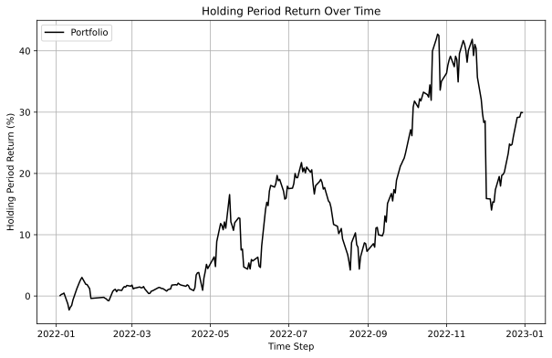
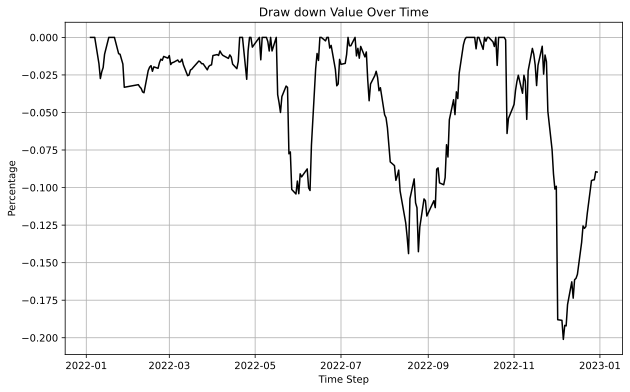
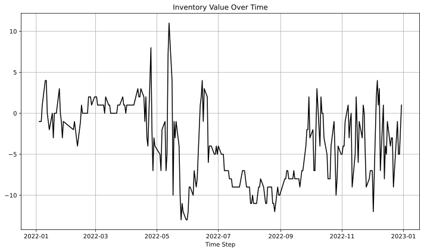
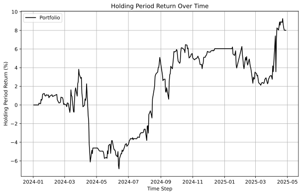
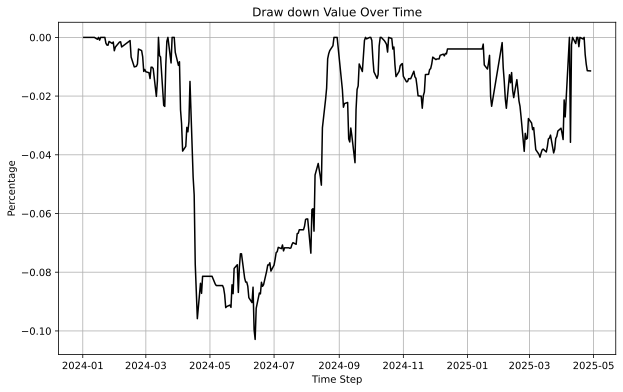
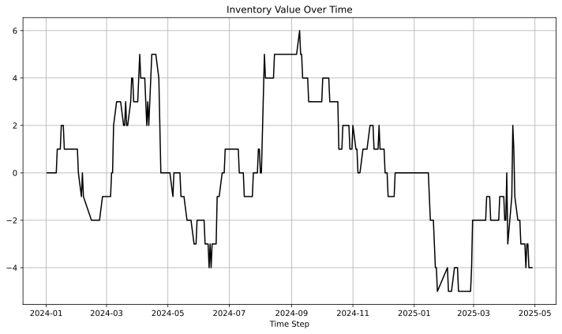

# PROTO:Market Maker
> Inventory-based two-sided quoting for VN30 index futures — place bid and ask limit orders skewed by current inventory.

## Abstract

PROTO:Market Maker is a market-making strategy for VN30 index futures that places simultaneous bid and ask limit orders sized and skewed by the maker's current inventory. Quote prices are recentered dynamically as the matched market price moves, using a configurable `step` distance that must exceed transaction fees plus slippage for the captured spread to be profitable. Quotes refresh every 15 seconds or whenever a resting order executes, and positions are carried overnight. The asset's valuation explicitly incorporates trading fees, forced-sale scenarios, and
contract expiration, so realized costs are not understated.

The strategy is developed and evaluated end-to-end on Algotrade VN30F1M / VN30F2M futures data (2022-01-01 to 2025-04-29) following the [9-step Development Process](https://www.algotrade.vn/knowledge/9-step-process/the-9-step) and the [Plutus Reproducibility Standard](https://github.com/algotrade-plutus/plutus-guideline). On the in-sample period (2022) it reaches a Sharpe of *0.95* and a *29.92%* holding-period return; on the out-of-sample period (2024-01-02 to 2025-04-29) it reaches a Sharpe of *0.08* and an *8.02%* holding-period return. Every reported number is reproducible in an isolated Docker container via `plutus-verify` against a committed groundtruth baseline (see [Implementation & Reproducibility](#implementation--reproducibility)).

## Introduction

Market making provides liquidity by continuously quoting both sides of the order book and earning the bid–ask spread. The central difficulty is *inventory risk*: when one side fills more than the other, the maker accumulates a directional position that adverse price moves can punish. A common remedy is to *skew quotes against inventory* — quoting more aggressively on the side that reduces the position — so the book naturally mean-reverts the maker's holdings while still capturing spread.

This project applies that idea to VN30 index futures: a two-sided, inventory-skewed quoting rule that recenters on the matched price and widens or tightens each side by the current inventory. The approach and its grounding in market-making practice follow the ALGOTRADE practitioner reference [1]. The sections below walk through the strategy under the PLUTUS Standard v2025 nine-step process.

## 1. Forming Algorithm Hypothesis

We hypothesize that inventory-aware two-sided quotes, recentered on the matched price, capture the bid–ask spread while keeping inventory bounded. Bid and ask prices are set as:

- $$bid = (price - step) - step * max(inventory, 0) * 0.02$$
- $$ask = (price + step) - step * min(inventory, 0) * 0.02$$

where `price` is the latest matched price, `step` is the base quote distance, and `inventory` is the signed position. The inventory term skews quotes to pull the position back toward zero. For the spread to be profitable, `step` must exceed the sum of transaction fee and slippage. Quotes are updated every 15 seconds or upon execution of a resting order, and positions are held overnight.

## 2. Data Preparation

- **Source:** Algotrade database — VN30 index futures (VN30F1M and VN30F2M).
- **Period:** 2022-01-01 to 2025-04-29.
- **Fees:** each buy or sell side is charged 0.4 / 2.

Daily close price, bid, ask, and tick data are collected from the Algotrade database via SQL queries (script: `data_loader.py`) and stored under `data/is/` (in-sample) and `data/os/` (out-of-sample).

### Obtaining the data

**Option 1 — Download from Google Drive (Recommended; no database credentials needed).**
This is the recommended path: the prepared data is published on Google Drive, so you can reproduce every downstream step without any database access. Download directly from [Google Drive](https://drive.google.com/drive/folders/181d7JcfHilIvviLgEuaDt2VqwZLYnYUF?usp=sharing). Place the `data/` folder at the repository root so the pipeline resolves `data/is/...` and `data/os/...`:

```
data
├── is
│   ├── VN30F1M_data.csv
│   └── VN30F2M_data.csv
└── os
    ├── VN30F1M_data.csv
    └── VN30F2M_data.csv
```

**Option 2 — Collect from the database.** Configure database credentials (see [Environment setup](#environment-setup)) and run:

```bash
uv run pmm-load-data
```

Output is written to `data/is/` and `data/os/`.

## 3. Forming Set of Rules

From the hypothesis we derive the concrete trading rules applied in every backtest:

- **Two-sided quoting:** at each update, place one bid and one ask using the Step 1 formulas, sized from available capital and the tradeable-contract limits.
- **Inventory skew:** the `0.02` inventory coefficient pulls quotes against the current position, biasing fills toward inventory reduction.
- **Update cadence:** refresh quotes every 15 seconds, or immediately when a resting order executes.
- **Cost accounting:** apply the 0.4 / 2 per-side fee; forced-sale scenarios and contract expiration add fees into the asset's valuation so returns reflect realized costs.
- **Overnight holding:** positions are carried overnight.

### Evaluation Metrics

The rules are evaluated with the following metrics, which are also the `expected` values verified by `plutus check`:

- **Sharpe ratio (SR)** and **Sortino ratio (SoR)** — annualized, benchmarked against a **6% per-annum risk-free rate** (≈ 0.023% per day).
- **Maximum drawdown (MDD)**.
- Supporting return measures: **holding-period return (HPR)**, **monthly return**, and **annual return**.

## Implementation & Reproducibility

With the rules and metrics defined, the strategy can be run and reproduced. The pipeline is packaged as `proto_market_maker` with console-script entry points (`pmm-load-data`, `pmm-backtest`, `pmm-optimize`, `pmm-evaluate`); each step below shows its own command.

### Environment setup
#### Setup the virtual environment
```bash
uv sync     # create the env from the committed uv.lock
```

Dependencies are pinned by the committed `uv.lock` (currently on the latest major lines — pandas 3.x, numpy 2.x); `uv sync` restores them exactly.

#### Database credentials (Optional)
*Database credentials are only needed if you intend to re-run the data preparation step from the database(Step 2, Option 2).* You can skip this entirely otherwise — the recommended path downloads the prepared data from Google Drive (Step 2, Option 1), and `plutus check` plus all backtests work with that, no database access required.

To regenerate the data from the Algotrade database, copy `.env.example` to `.env` at the repo root and fill in the credentials:

```env
HOST=<host name or IP address>
PORT=<database port>
DATABASE=<database name>
USER_DB=<database user name>
PASSWORD=<database password>
```

### Reproducibility

This repo ships a `.plutus/manifest.yaml` declaring the environment, data sources, steps, and expected metrics. Reproduce every result in an isolated Docker container with [plutus-verify](https://github.com/algotrade-plutus/plutus-verify) **v0.5.0**, installed straight from the public release wheel — no build-from-source needed:

```bash
# Requires Docker running. `uv venv` provisions a suitable Python (>= 3.11)
# automatically — no system python/pyenv needed.
uv venv .plutus-venv && source .plutus-venv/bin/activate
uv pip install "plutus-verify[runner] @ https://github.com/algotrade-plutus/plutus-verify/releases/download/v0.5.0/plutus_verify-0.5.0-py3-none-any.whl"

plutus check .     # build -> run each step in-container -> compare vs baseline
```

The `[runner]` extra brings Docker, repo2docker, and gdown, so `plutus check` builds the image, downloads the dataset from the declared Google Drive source, installs this package, runs each step's console script in-container, then compares the produced metrics and charts against the committed baseline in `.plutus/expected/`. Exit code `0` = reproduced (within tolerance), `1` = partial, `2` = failed.

## 4. In-sample Backtesting

Specify the period and parameters in `parameter/backtesting_parameter.json`, then run:

```bash
uv run pmm-backtest
```

Charts are written to `result/backtest/`.

### In-sample result (2022-01-01 to 2023-01-01)

| Metric                 | Value   |
|------------------------|---------|
| Sharpe Ratio           | 0.9516  |
| Sortino Ratio          | 1.3490  |
| Maximum Drawdown (MDD) | -0.2010 |
| HPR (%)                | 29.92   |
| Monthly return (%)     | 1.81    |
| Annual return (%)      | 17.10   |

HPR chart — `result/backtest/hpr.svg`


Drawdown chart — `result/backtest/drawdown.svg`


Daily inventory — `result/backtest/inventory.svg`


## 5. Optimization

The optimization search space is configured in `parameter/optimization_parameter.json`; a fixed random seed makes the search reproducible. Run:

```bash
uv run pmm-optimize
```

The optimized parameters are written to `parameter/optimized_parameter.json`. With seed `2025`, the current optimum is:

```json
{
    "step": 3.1
}
```

## 6. Out-of-sample Backtesting

Using the optimized parameters from Step 5, evaluate on the out-of-sample period (parameters in `parameter/backtesting_parameter.json`):

```bash
uv run pmm-evaluate
```

`pmm-evaluate` reads `parameter/optimized_parameter.json`; charts are written to `result/optimization/`.

### Out-of-sample result (2024-01-02 to 2025-04-29)

| Metric                 | Value   |
|------------------------|---------|
| Sharpe Ratio           | 0.0815  |
| Sortino Ratio          | 0.1183  |
| Maximum Drawdown (MDD) | -0.1028 |
| HPR (%)                | 8.02    |
| Monthly return (%)     | 0.57    |
| Annual return (%)      | 6.21    |

HPR chart — `result/optimization/hpr.svg`


Drawdown chart — `result/optimization/drawdown.svg`


Daily inventory — `result/optimization/inventory.svg`


## Reference

[1] ALGOTRADE, Algorithmic Trading Theory and Practice - A Practical Guide with Applications on the Vietnamese Stock Market, 1st ed. DIMI BOOK, 2023, pp. 52–53. Accessed: May 12, 2025. [Online]. Available: [Link](https://hub.algotrade.vn/knowledge-hub/market-making-strategy/)

---

## Running the Market Maker Paper Trading

```bash
python3 papertrade/paper.py
```

Console output shows the latest matched price, placed orders, balances, and portfolio state in real time.

---

## ⚙️ Environment Setup

All required credentials and configurations are stored in a `.env` file.
Create a `.env` in the project root:

```ini
# Paper Broker account credentials
PAPER_ACCOUNT=
PAPER_USERNAME=
PAPER_PASSWORD=
PAPER_CFG=
PAPER_REST_BASE_URL=

# Kafka connection settings
KAFKA_BOOTSTRAP_SERVERS=
KAFKA_TOPIC=
INSTRUMENT=
KAFKA_USERNAME=
KAFKA_PASSWORD=
```

Then install dependencies and run the strategy:

```bash
pip install papertrade/paperbroker_client-0.1.4-py3-none-any.whl
pip install -r requirements.txt
python3 papertrade/paper.py
```

---
