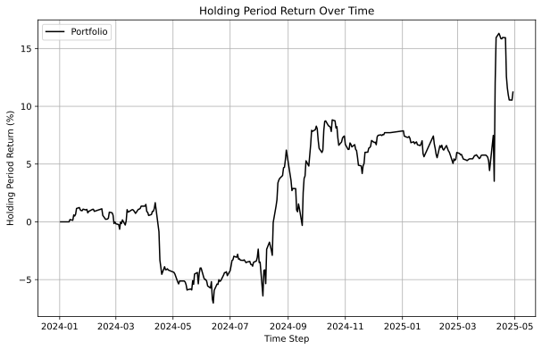
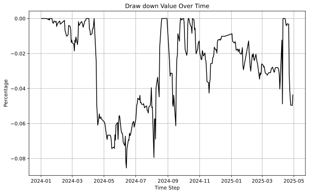
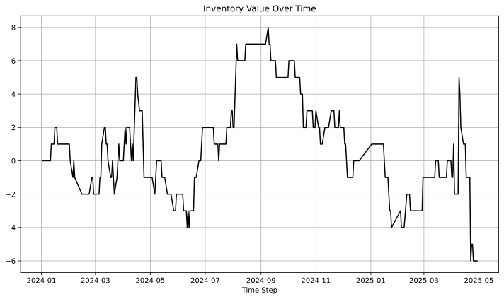

 

# PROTO:Market Maker

## Place bid-ask base on inventory
> Place limit order in two sides base on current inventory quantity

## Abstract
In this project, we utilize inventory quantities to simultaneously place both bid and ask orders. The prices of these orders are adjusted dynamically in response to changes in the matched market price. Forced sale scenarios and asset expiration dates are accounted for by incorporating additional fees into the asset's valuation.

## Introduction
In market making, one common approach to liquidity provision involves simultaneously placing bid and ask orders based on the current inventory levels held by the market maker. This strategy dynamically adjusts order prices in response to changes in the matched market price, allowing the market maker to maintain balanced exposure while capturing the bid-ask spread. The positions are held overnight.

## Hypothesis
We place bid and ask price with our formula:
- $$bid = (price - step) - step * max(inventory, 0) * 0.02$$
- $$ask = (price + step) - step * min(inventory, 0) * 0.02$$

The step size should exceed the sum of the transaction fee and slippage. Bid and ask prices are updated either every 15 seconds or upon the execution of a position.

## Data
- Data source: Algotrade database
- Data period: from 2022-01-01 to 2025-04-29
- Each sell or buy side will be charge 0.4 / 2 fee.
### Data collection
#### Daily closing price data
- The daily close price, bid, ask and tick price are collected from Algotrade database using SQL queries. 
- The data is collected using the script `data_loader.py` 
- The data is stored in the `data/is/` and `data/os/` folders. 

## Implementation
### Environment Setup
1. Set up python virtual environment
```bash
python -m venv venv
source venv/bin/activate # for Linux/MacOS
.\venv\Scripts\activate.bat # for Windows command line
.\venv\Scripts\Activate.ps1 # for Windows PowerShell
```
2. Install the required packages
```bash
pip install -r requirements.txt
```
3. (OPTIONAL) Create `.env` file in the root directory of the project and fill in the required information. The `.env` file is used to store environment variables that are used in the project. The following is an example of a `.env` file:
```env
DB_NAME=<database name>
DB_USER=<database user name>
DB_PASSWORD=<database password>
DB_HOST=<host name or IP address>
DB_PORT=<database port>
```
### Data Collection
#### Option 1. Download from Google Drive
Data can be download directly from [Google Drive](https://drive.google.com/drive/folders/181d7JcfHilIvviLgEuaDt2VqwZLYnYUF?usp=sharing). The data files are stored in the `data` folder with the following folder structure:
```
data
├── is
│   ├── VN30F1M_data.csv
│   └── VN30F2M_data.csv
└── os
    ├── VN30F1M_data.csv
    └── VN30F2M_data.csv
```
You should place this folder to the current ```PYTHONPATH``` for the following steps.
#### Option 2. Run codes to collect data
To collect data from database, run this command below in the root directory:
```bash
python data_loader.py
```
The result will be stored in the `data/is/` and `data/os/`
### In-sample Backtesting
Specify period and parameters in `parameter/backtesting_parameter.json` file.
```bash
python backtesting.py
```
The results are stored in the `result/backtest/` folder.

### Optimization
To run the optimization, execute the command in the root folder:
```bash
python optimization.py
```
The optimization parameter are store in `parameter/optimization_parameter.json`. After optimizing, the optimized parameters are stored in `parameter/optimized_parameter.json`.

### Out-of-sample Backtesting
[TODO: change the script name to out_sample_backtest.py or something like that]: #
To run the out-of-sample backtesting results, execute this command
```bash
python evaluation.py
```
[TODO: change the name of optimization folder to out-of-sample-backtesting or something like that]: #
The script will get value from `parameter/optimized_parameter.json` to execute. The results are stored in the `result/optimization` folder.

## In-sample Backtesting
Running the in-sample backtesting by execute the command:
```bash
python backtesting.py
```
### Evaluation Metrics
- Backtesting results are stored in the `result/backtest/` folder. 
- Used metrics: 
  - Sharpe ratio (SR)
  - Sortino ratio (SoR)
  - Maximum drawdown (MDD)
- We use a risk-free rate of 6% per annum, equivalent to approximately 0.023% per day, as a benchmark for evaluating the Sharpe Ratio (SR) and Sortino Ratio (SoR).
### Parameters
### In-sample Backtesting Result
- The backtesting results are constructuted from 2022-01-01 to 2023-01-01.
```
| Metric                 | Value                              |
|------------------------|------------------------------------|
| Sharpe Ratio           | 1.5619                             |
| Sortino Ratio          | 2.3335                             |
| Maximum Drawdown (MDD) | -0.1891                            |
| HPR (%)                | 53.41                              |
| Monthly return (%)     | 3.80                               |
| Annual return (%)      | 42.52                              |
```
- The HPR chart. The chart is located at: `result/backtest/HPR.png`

- Drawdown chart. The chart is located at `result/backtest/drawdown.png`

- Daily inventory. The chart is located at `result/backtest/inventory.png`


## Optimization
The configuration of optimization is stored in `parameter/optimization_parameter.json` you can adjust the range of parameters. Random seed is used for reconstructing the optimization process. The optimized parameter is stored in `parameter/optimized_parameter.json`
The optimization process can be reproduced by executing the command:
```bash
python optimization.py
```
The currently found optimized parameters with the seed `2025` are:
```json
{
    "step": 2.9
}
```
## Out-of-sample Backtesting
- Specify the out-sample period and parameters in `parameter/backtesting_parameter.json` file.
- The out-sample data is loaded on the previous step. Refer to section [Data](#data) for more information.
- To evaluate the out-sample data run the command below
```bash
python evaluation.py
```
### Out-of-sample Backtesting Result
- The out-sample backtesting results are constructuted from 2024-01-02 to 2025-04-29.
```
| Metric                 | Value                              |
|------------------------|------------------------------------|
| Sharpe Ratio           | 0.0162                             |
| Sortino Ratio          | 0.0276                             |
| Maximum Drawdown (MDD) | -0.0854                            |
| HPR (%)                | 11.23                              |
| Monthly return (%)     | 1.01                               |
| Annual return (%)      | 11.25                              |
```
- The HPR chart. The chart is located at `result/optimization/hpr.svg`.

- Drawdown chart. The chart is located at `result/optimization/drawdown.svg`.

- Daily inventory. The chart is located at `result/optimization/inventory.svg`


## Reference
[1] ALGOTRADE, Algorithmic Trading Theory and Practice - A Practical Guide with Applications on the Vietnamese Stock Market, 1st ed. DIMI BOOK, 2023, pp. 52–53. Accessed: May 12, 2025. [Online]. Available: [Link](https://hub.algotrade.vn/knowledge-hub/market-making-strategy/)
